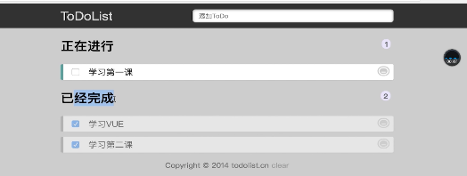
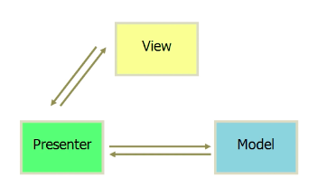
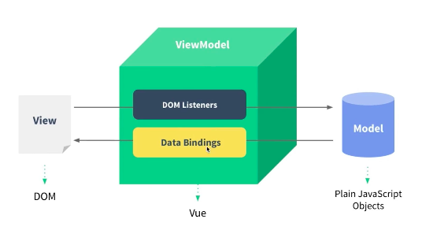
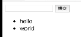

# 2-1

打开文档对文字进行阅读，也就是代码和线上的网站例子同步。

这个实战涉及到vue的方方面面

# 2-2 使用vuejs实现hello world

使用vue不支持低版本ie8以下的浏览器的。

[vuejs中文官方网站](https://cn.vuejs.org/v2/guide/installation.html)

# 2-3 vuejs实现todolist

## 1. 模版指令

1. v-for
2. v-on 要和methods绑定，会先去查找methods里面的方法
3. v-model 指的是数据的双向绑定，两者都会发生变化

# 2-4 MVVM模式

MVVM
M层 data:{}就是数据
V层 上面的dom就是v
VM层 使用方法对数据进行操作，V层就变化了

这样的好处就是只要关注m层的变化就可以了，这样的代码可以节约，
vue是怎么知道数据改变从而去改变V？用到了虚拟dom以及define property的知识

> jquery.html没有成功

# 2-5 前端组件化

## 1. 什么叫组件？
就是页面的一个部分，每个部分称之为一个组件。合理的拆分组件，每个组件就会更容易一些。会使代码在维护性上大大提高，每个组件就是页面上的一个人区域。

# 2-6 使用组件化思想修改todolist的功能

每次提交都会生成列表项，那么就可以把列表项作为单独的部分

首先定义了一个组件叫TodoItem,这是一个全局的组件，所以直接可以在我们的模版里面使用todoitem
,我用list决定循环多少个todolist组件，同时把每一个list的项的内容通过v-bind的语法，借助content传给todo-item这个子组件，todo-item如果想使用父组件传递过来的数据，这个要在props里对content进行一个接收，接收完了之后我们模版里面用到了content就会把他渲染处理啊，这是第一种全局组件的使用。
`index.html`

第二中局部组件，该怎么定义呢？直接这样定义，`index1.html`

# 2-7 简单的组件间传值

我们现在希望点击hello的时候把hello删除掉，点击world的时候把world删除掉

`v-bind` 可以省略