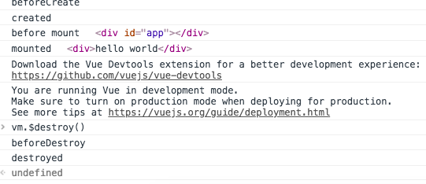
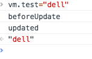
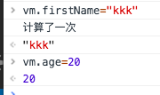
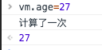
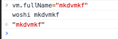
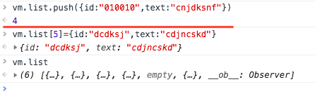
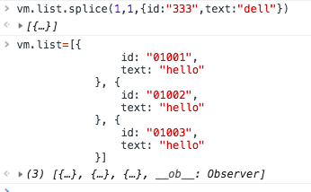
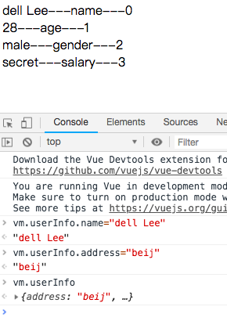
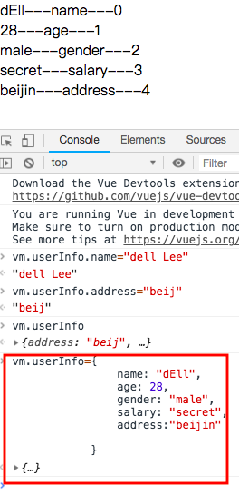
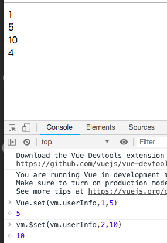

# 03-01 vue实例

`vm.$data`,`vm.$el`以$开头的指的是vm的实例属性或者实例方法

`vm.$destroy()`销毁实例的，我们可以用`vm.$data.message="bye bye"`设置一下生不生效就知道有没有销毁

# 03-02 vue实例的生命周期钩子

[vue的生命周期图例](https://cn.vuejs.org/v2/guide/instance.html#%E7%94%9F%E5%91%BD%E5%91%A8%E6%9C%9F%E5%9B%BE%E7%A4%BA)


## 1. 8个生命周期钩子

* 时间点
* 自动执行
* vue实例的生命周期函数没有放在methods里面
* vue源码里面有[11个生命周期函数](https://cn.vuejs.org/v2/api/#beforeCreate)

其他的三个生命周期函数在后面讲解

布置的小作业：vue实例章节进行仔细阅读。不但找到视频中找到的内容，还有别的仔细的点。有不懂的可以在留言区留言

## 2. code




# 03-03 vue的模版语法

* 讲解了三个模版语法。其中X值表达式和v-text的功用是一样的。
* 这三个都可以写语法表达式，而不仅仅是变量

# 03-04 计算属性 方法和桢听器

一个方法可以通过watch,methods,computed方法来实现的时候，我们优先推荐computed.computed简洁，代码量少




# 03-05 计算属性的setter和getter



# 03-06 vue中的样式绑定

## 1. 

* 判断class的两中方式，一种是定义一个数组
* 而且，我们不只是使用一个，还可以使用俩个变量index3.html
* 除了用class是不是可以用style,来改变页面样式 index4.html
* style还可以用数组的，和class差不多 index5.html

## 2. 总结 

无论是数组还是对象的方式都有两种方法来展示

# 03-07 vue中的条件渲染

## 1. 指令

* ``指令。v-if如果是false说明这个div是不应该展示
* `v-show`一个和v-if很像的
* `v-else` 和v-if是成对的 index1.html
* `v-else-if` index2.html
* `v-if` `v-else` 再写input框的时候，input框内的内容没有被清空 index3.html ？vue 重新去渲染的时候，它会尝试复用input,如果要解决这个问题，可以添加一个key值,因为当去添加key的时候，vue知道他们是唯一的，这是vue virtual Dom里面的diff算法 index3.html

## 2. 操作

在控制台做一个操作`vm.show=true`,查看产生的变化

v-if:如果为false,那么根本就不会出现在页面上
v-show：为false,存在于dom上，只是display:none


作业：自己读一遍官方文档到列表渲染就可以了

# 03-08 vue中的列表渲染

在div元素上加上唯一的值，一般来说不建议使用index作为key值，因为在频繁操作dom元素上数据的时候，他还是比较费性能，那么不用index作为key值用谁呢？
 后端返回数据一般会有数据的条目符号，这个是数据标志的唯一值，可以放在div上作为唯一的key值。

 在index.html的例子上会发生一个奇怪的问题是，两种添加的方式产生的效果不同，第一种有效，第二种无效,第二种添加了元素但是不会在View层上面显示出来。



讲到这就要讲一个内容，当我们尝试修改数组里面内容的时候，不能通过下标的方式去改变数组，只能通过vue提供的几个数组变异方法来操作数组才能够实现数据发生变化页面页发生变化。

1. 改变数据从而改变显示的第一种，用splice pop push shift unshift reverse等等
2. 第二种方式是直接改变数据的引用。



1. template占位符号。他包裹元素，但是补回被渲染出来 index1.html

2. 除了数组，对象也可以做循环 index2.html



当你动态的去增加对象的时候并不好加，那么就应该这么来加。直接用他的引用。




# 03-09 vue中的set方法

## 1. vue中提供set方法向对象里面加入数据。

```
Vue.set(vm.userInfo,"kkk","beijjj")
```

```
vm.$set(vm.userInfo,"address","beijin")
```
## 2. vue中set怎么向数组里面添加数据
 index1.html

1. 数组的变：pop shift 这些
2. 数组的引用
3. set方法


