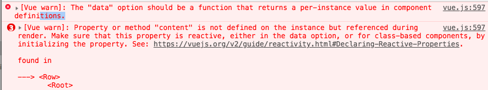
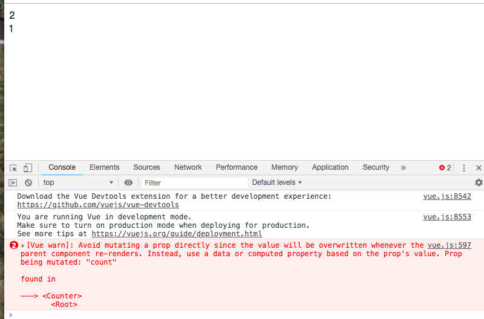
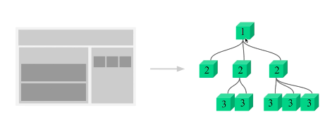

# 04-01 组件使用中的细节点

## 1. 细节点1
```
Vue.component('row',{
template:'<tr>
    <td>this is a row</td>
</tr>'
})
// 希望每一行的数据都是一个子组件
var vm = new Vue({
el:"#root"
```

>总结：使用is解决一些小bug

## 2. 细节点2

index1.html


```

<body>
    <div id="root">
        <table>
            <tbody>
                <tr is="row"></tr>
                <tr is="row"></tr>
                <tr is="row"></tr>
            </tbody>
        </table>
    </div>
</body>
<script>
    Vue.component('row', {
        data: {
            content: 'this is a row'
        },
        template: '<tr><td>{{content}}</td></tr>'
    })
    // 希望每一行的数据都是一个子组件
    var vm = new Vue({
        el: "#root"

    })

    /* 发现这样子是不行的， */
</script>
```




这是因为在根组件里面也就是最外层的vue实例，如果我定义data直接通过对象定义是没有问题的，但是如果在子组件里面定义data就不能这么定义了，data的定义必须要求是个函数且返回一个数据

之所以这么设计是因为一个子组件不像根组件调用一次，每一个子组件的数据我不希望像其他的子组件那样产生冲突，每一个子组件都应该要有自己的数据。通过一个函数返回一个数据的目的是希望每个组件有独立的组件存储，这样的话不会出现多个子组件之间互相影响的情况

>子组件定义data要是一个函数

## 3. 细节点3
index3.html

有时候在vue中需要出现直接操作dom的情况，那么怎么操作呢？就是通过ref.`this.$refs.hello.innerHTML`

> ref的使用

## 4. 做计数器的功能

index4.html

计算连个counter的求和。做一个发布订阅的模式。子组件向父组件传值

这个例子主要是使用ref的使用在组件上

>ref在子组件上的使用

# 04-02 父子组件的数据传递

## 1. 父组件如何向子组件传递数据

```
//index.html

var counter = {
props:['count'], //父组件向子组件传递数据count,props是接受从父组件传递的属性
template: '<div @click="handleClick">{{count}}</div>',
methods:{
handleClick:function(){
this.count++
}
}
}


```

子组件这样写会报错，要你不要直接修改父组件里面的值，虽然操作也能成功。



这是因为vue里面有一个`单向数据流`的概念。也就是父组件可以向子组件传递参数，传递的参数可以随便修改，但是子组件是绝对不能反过来去修改父组件传递过来的内容。之所以有单向数据流的概念，一旦子组件接受过来的参数不是基础的数据类型，而是object的那种，你在子组件改变了传递过来的一些内容有可能接受到的引用类型的数据也被其他的子组件所使用，因此你这个子组件改变的数据不只是改变了你自己的，也可能改变了别人的。

怎么改呢？子组件自己复制一份

## 2. 子组件如何向父组件展示数据

index1.html

子组件触发事件，父组件去监听。

`this.$emit('inc',1)` 里面的1是步长。

# 04-03 组件参数校验与非props特性

## 1.组件参数校验

父组件向子组件传递参数是有一定规则的。

```
props: {
content: Number //我这里规定我要的是string类型
},
```

是number，

```
content: [Number,String] //要么是数字，要么是string
```

content还可以是一个对像。

## 2. 非props特性

index1.html

就是父组件向子组件传递了一个内容，但是子组件并没有用父组件传递的内容。

1. 子组件不获取就没法用
2. 如果现在使用非props特性，那么非props特性属性是会展示在子组件dom最外层的标签之中的。实际场景中非props用的场景并不多。

# 04-04 给组件绑定原生事件

index.html
1. 我们绑定原生事件是在div上绑定的而不是在组件上绑定，绑定在组件上的是监听的自定义事件。这样子两层的传递太麻烦了，我就是想监听子组件就能监听到事件 。

index1.html
2. ` <child @click.native="handleClick"></child>` 直接在组件上绑定原生事件加上`native`就可以了


# 04-05 非父子组件间的传值

如图可以把网页拆解成不同的部分


传值 1层向2层 2层向3层 一层层的传递太麻烦了
两个组件传值，但是两个组件不具备父子关系

1. 通过vuex，
2. 发布订阅模式-总线模式

index.html 兄弟组件相互改变

```

<body>
    <div id="root">
        <child content="Dell"></child>
        <child content="Lee"></child>
    </div>
</body>
<script>
    /* 在vue的原型上挂载的一个属性，每次创建属性的时候都会有这么一个属性bus */
    Vue.prototype.bus = new Vue()

    Vue.component('child', {
        template: '<div @click="handleClick">{{content}}</div>',
        props: {
            content: String
        },
        methods: {
            handleClick: function () {
                this.bus.$emit('change', this.content)
            }

        },
        mounted: function () {
            this.bus.$on('change', function (msg) {
                alert(msg)
            })
        }
    })

    var vm = new Vue({
        el: '#root'
    })
    /* */
</script>

```

各自点击的时候这里的内容弹出了两次，这是因为在一个child组件里面触发事件的时候，其实这两个child组件都进行了事件的监听，所以两个child组件会去弹message,

>这边bus的我不是很懂 ，就是说发布订阅模式

# 4-6 在vue中使用插槽(slot)

## 1.

什么时候用到slot?子组件里面出了p标签外还要展示一段内容，这段内容不是我子组件所决定的，而是父组件传递过来的。

以前是通过props传值。

```
template: `<div>
    <p>hello</p>
    <div v-html="this.content"></div>
</div>`
```

这样写的问题是外层会多出一个div标签。

## 2.

因此就多了个插槽的概念。

index1.html

1. slot显示的就是父组件里面的标签，
2. 可以在slot里面写一些默认的内容 `template: <div>
    <slot>默认内容</slot>
</div>`

index2.html

给slot写名字指定是那个。

# 4-7 作用域插槽

父组件调用子组件的时候给子组件传了一个插槽，这个插槽叫做作用域插槽，
作用域插槽是template开头和结尾的内容，同时这个插槽要声明我从子组件接受的数据都放在那，这里是都放在props里面

# 4-8 动态组件与v-once指令

1. index.html 传统的方法 实现点击切换
2. index1.html 动态组件的方法

动态组件就是会根据is里面数据的变化动态加载不同的组件

3. v-once指令 index2.html
第一个组件不用了，用第二个组件他就会帮我们把第一个组件销毁掉再创建第二个组件。假设第二个组件要隐藏，第一个组件要显示的话，这个时候把第二个组件销毁掉再创建第一个组件。也就是每次切换的时候底层都把第组件销毁掉再创建一个新的组件。这种操作其实是耗费了一定的性能的。

`v-once`会帮我们提高静态页面结构的展示效率。当child-one展示的时候，因为它里面有个v-once指令，因此就直接放到内存里面了，当切换的时候，child-two第一次展示他也会被放到内存里。当我再点击的时候并不需要再重新创建一个，而是直接从内存里面拿出以前存的那个。