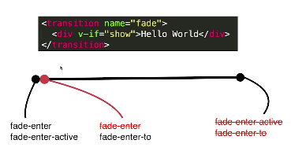
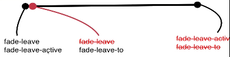

# 5-1 vue中css动画原理

我希望我的hello world有个渐隐渐现的效果。



先了解transition对应的过渡动画原理？

1. 当一个元素被transition包裹了以后呢，vue会自动的分析元素的css样式构建动画的流程。
2. 在div即将被执行的一瞬间，他会往div上增加两个class名字，`fade-enter`和`fade-enter-active`.当动画第一桢执行过后，transition这个标签知道这个动画效果之后，vue会在动画运行到第二帧的时候会帮你干两件事，会把之前`fade-enter`去掉，再增加一个`fade-enter-to`这样的一个名字.接着动画继续执行到最后会把fade-enter-active和fade-enter-to去掉

都以fade来开头是因为`transition`的name命名为`fade`，他本来默认的是`v`,



# 5-2 在vue中是要animate.css库

1. 如何使用keyframes这样的动画 index.html
2. 如何自定义动画的类名 index1.html,可以自定义的话那么就可以使用animated的库了
3. animated库的使用 index2.html

# 5-3  在vue中同时使用过渡和动画

1. 我们发现的是在第一次加载的时候动画是没有加上去的。如果我想在第一次显示的时候也具备动画的效果。增加一个`appear-active-class`和`appear`

2. 假设我希望入场的动画效果不仅有css3(keyframes)的还有过渡(transition)的动画效果那应该怎么办呢？index1.html。再加一个`fade-enter-active`的类名。写的时候transition的动画时间是3s，keyframe的动画时间是3s，那么到底是那个呢？其实vue也不清除，但是这个可以手动的设置。加上一个`type="transition"`,他的意思是我的动画既有transition的又有keyfram的动画，且我的动画时间以transition的设置为准。

3. 现在是以过渡动画的时长为总时长，那么能不能我自己定义一个总时长那呢？index1.html

`:duration="10000"` 我希望播放时间是10s。还可以设置入场动画的时长和出场动画的时长。`{enter:5000,leave:10000}`


# 5-4 vue中的js动画与velocity.js的结合

vue中提供了很多动画的钩子，点那个元素显示的一瞬间会触发beforeEnter的代码，

## 1. 入场动画

1.  @before-enter:在动画发生之前
2. @enter：在动画发生的时候
3. @after-enter:在动画发生之后

## 2. 出场动画

1. @before-leave
2. @leave
3. @after-leave

## 3.动画库 velocity.js

index1.html

把velocity.js引入，引入以后就可以实现一些动画了。

```
 Velocity(el,{opacity:1},{duration:1000,complete:done})
```
>Velocity在第二次执行的时候是有点问题的，这里面需要complete:done才能执行下一个@after-enter的动画

# 05-05 vue中多个元素或组件的过渡动画

## 1. 过渡动画

1. 
当show为true的时候显示hello world,当show为false的时候显示bye world.

2. 还有mode参数来显示切换时的一个效果`out-in`:先隐藏再显示与`in-out`先显示再隐藏

## 2. 动态组件实现组件间的动画效果

index1.html 组件间的切换

通过动态组件来实现切换 index2.html

# 05-06 vue中的列表过渡

能不用index作为key值就不要用。

1. 单个做动画
2. 多个间的显示隐藏做动画
3. 现在是循坏列表的插入与隐藏做动画


```
<transition-group>
            <div v-for="item of list" :key="item.id">
                {{item.title}}
            </div>
        </transition-group>
```

其实这个就相当于每一个的这个
```
<transition>
<div>hello world</div>
</transition>

```

# 05-07 vue中的动画封装

有的时候渐隐渐现效果比较多，就想把他们封装起来。所有的动画都写在一个组件里面

# 05-08 章节小结

>这里提了一次动画过渡和状态过渡