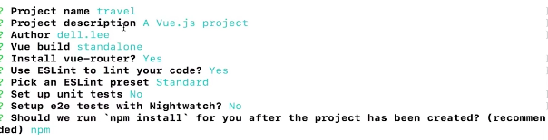
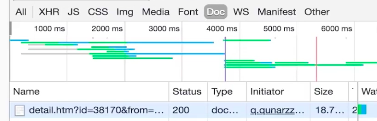

# 06-01 环境项目准备

1. nodejs运行环境
2. git仓库的介绍等等

```
npm install --global vue-cli

vue init webpack my-project //创建一个vue的项目
```



# 6-2 Vue项目预热 - 项目代码介绍

项目代码结构

* package.lock.json-是package.json文件的锁文件，它可以去确认你确定的第三方的版本，保持团队编程的统一，
* index.html
* eslintrc-代码规范
* eslintrc.js-这些不受编码规范的影响
* .editorconfig-统一代码自动化的代码格式化
* .babelrc-代码转换
* static-静态的资源
* src
    * main.js是我们项目的入口文件
    * app.vue是我们项目的最原始的那个根组件
    * router/index.js-项目所有的路由都放在这里
    * components-放得是项目里面要用的小组件
    * assets-放得是项目里面要用到的图片资源
* config-基础的配置信息放在index.js,开发环境的配置信息放在dev.env.js,线上环境的配置信息放在prod.env.js

* build-放得是项目打包的webpack的一些内容

# 6-3 单文件组件与vue中的路由

代码在06-01 

## 1. 单文件组件

当一个文件以`.vue`结尾的时候，我们把这个叫做但文件组件。
以前是

```
Vue.component('child',{})
```

这样子创建组件，现在直接是以.vue结尾的就是组件

## 2. 路由就是根据网址的不同，返回不通的内容给用户

`router-view`-显示的内容就是当前路由地址所对应的内容，

访问根路径的时候，我希望页面上展示的是首页，而不是hello world单文件组件 06-03

1. 删掉components,新建一个pages文件夹
2. 访问根路径下list的时候，我让你去访问list这样一个组件

# 6-4 多页应用 vs 单页应用

像这种点到`doc`,每次访问新的网址的时候都会返回一个新的html给你的就是多页面应用




## 1. 为什么首屏时间快？

因为你去访问页面的时候服务器会给我们返回一个html,然后页面就会展示出来。这个过程服务器只经历了一个http请求。

## 2. 

原因是这样的：js会感觉到url的变化，js感觉到url的变化以后呢我们可以用js把当前动态的内容清除掉。再把下一个页面的内容挂载到页面上，这时候这个路由不是后端来做而是前端来做，我们判断路由到底显示那个页面。我们把以前的组件清除掉再显示新的路由。


vue中还有服务器渲染的技术，通过这些技术可以完美的解决他的那些缺点的问题。解决了那些问题以后，单页面应用对我们前端来说是完美的开发解决方案。

# 6-5 项目代码初始化

## 1. 设置meta标签

```
  <meta name="viewport" content="width=device-width,initial-scale=1.0,
    minimum-scale=1.0,maximum-scale=1.0,user-scalable=no
    ">
```
这样移动端的设备，用户去通过手指放大缩小这样子是无效的。他的页面的比例始终是1:1.

## 2. 引入reset.css

不通手机的初始化样式做一个统一。可以在作者的仓库上拉取。

1. 新建assets/reset.css文件夹。
2. 我在项目里面应用reset.css
3. 引入border.css 移动端有个1像素问题。这是为了解决多倍频里面会被显示成多个的像素。
4. 在移动端的项目会有一个问题就是300ms点击延迟的问题。在移动端开发中，在某些机型上，某些浏览器上，当你使用click事件的时候，这个click事件会延迟300ms再执行。解决的是引入fastclick库。`npm install fastclick --save`,
5. iconfont引入项目


