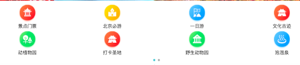

# 07-01 首页header的开发

1. 首页宽度750px,按照iphone给的2倍图的设计稿,在制作页面的时候就会以2倍图的效果制作

2. 在这个项目中我们希望使用styles来帮我们写相当于less这些

```
npm install stylus --save
npm install stylus-loader --save
```
3. 在home文件夹下新建一个component.再创建Header.vue

4. .header 的height=86px; 因为2倍图，所以是43px,因为reset设置了html 50px,1rem=50px 所以43px = 0.86rem.
5. 在build/webpack.base.conf.js里面配置公用的一些组件 alias
6. 在main.js里面引入文件reset.css等等需要公用的文件

# 7-2 iconfont的使用和代码优化

代码在07-01 


1. 新建iconfont文件夹在 src/assets下 把iconfont.css放大styles之中

2. 新建stylus下的varibles.styl,写上一些变量.

3. 引入css文件 `@import '../../../assets/styles/varibles.styl'`,也可以这样写，`@import '~@/assets/styles/varibles.styl'`,在css中引入css要带`~`

4. stylus这个目录很多都要用到，那么就想让他和`@`一样方便使用。在webpack.base.config.js里面设置就可以了。

# 7-3 Vue项目首页 - 首页轮播图

1. 用到一个插件 [vue-awesome-swiper@2.6.7](https://github.com/surmon-china/vue-awesome-swiper/tree/v2.6.7)来做轮播图的插件

2. 打开这个网址，到去哪网上找两张图片[手机去哪网](http://piao.qunar.com/touch/)

3. 在图片下的文字，在3g模式下会有一个明显的抖动，这是为什么呢？因为图片没有加载的时候高度是0,图片加载完了再把高度撑开，这样用户去访问页面的时候会有明显的抖动感。
解决方法是给swiper加上一个div.

```
.wrapper
    .wrapper
    overflow: hidden
    width :100%
    height: 0
    padding-bottom:31.25%
```

这里是设置宽高比是31.25,如果给height设置31.25，它其实相对的是他父级的高度。这张图片的宽高比是31.25。

也可以这么写:

```
.wrapper
    width :100%
    height: 31.25vw
```

这么写的意思也是相当于31.25视口的宽度，但是这么写可能一些浏览器上的兼容会有问题。最标准的还是第一种写法。
4. 现在做选中状态的样式，可以在swiperOption的选项。
5. 发现在scoped里面加上背景颜色是没有用的，因为它的样式是只修饰当前组件中的名字，不会对其他组件进行任何的影响，但是我这个swiper组件决定的。那么我想去修饰怎么办？

把下面的这个代码移动到scoped的最顶层

```
.wrapper >>> .swiper-pagination-bullet-active
    background:#fff !important 
```

这样子就变红了，但是这个是什么意思呢？`>>>` 就出现了穿透，就是出现在.wraper下的就会改变。

6. 做一个修改，现在的swiper-slider都是直接输出的，我们希望他做一个循环输出。做一个swiperList在Swiper.vue的页面.vue是以数据驱动的。

```

```
上面的`:`是做一个绑定

# 7-4 Vue项目首页 - 图标区域页面布局



做的是上面那部分的开发

1. 关于padding-bottom

```
.icons
  height :0
  padding-bottom :50%
  overflow:hidden
  background:green
  .icon
    float:left
    width :25%
    padding-bottom:25%
```

`icons`:当width:100%的话，那么高度就是宽度的50%，`icon`里面的样式，这个的意思就是宽度是25%,那么高度也是25%.

# 7-5 Vue项目首页 - 图标区域逻辑实现

代码在7-4 合并了

现在页面是8个图标，我希望当我有9个图标的时候，页面可以左右拖动和上面一样轮播的效果。

1. 发现在上面左右拖动的时候ok,在下面的时候就不可以。
2. 循环输出，图标有10个的时候，我们是一个swiper显示的是8个图标，那么这时候就要用到计算属性.计算属性是根据其他属性计算出来，生成的一种新的结果，它自带缓存，且比较简单

3. 安装插件`vue-devtools`方便调试代码以及查看里面的数据、
4. 再做一点优化，如果景点门票那一行的字太多的话显示`...`
5. 这个`...`如果用到的地方比较多的话，那么就封装放在一块。touch assets/styles/mixins.styl

# 7-6 Vue项目首页 - 热销推荐组件开发

>这一节的视频无

# 7-7 Vue项目首页 - 开发周末游组件

1. 新建weekend.vue,这个表的内容和recommand很像。所以把recommand复制一份，再小修改
2. 打开swiper 组件用了组件 ，这里用了slot，那么自己想下slot究竟是干什么的。

# 7-8 Vue项目首页 - 使用 axios 发送 ajax 请求

1. 在vue中发送ajax有很多可以供我们使用，比如浏览器自带的`fetch`,`vue-recesource`, `axios`。`axios`非常强大，可以帮助你实现跨平台的数据的请求，eg:你在浏览器端 axios可以帮助你发送`XHR`的请求，在node服务器上可以发生http的请求

2. 安装`yarn add axios --save`,
3. 首页有5个数据，如果发5个请求的，那么网站的效率是很低的，因此首页发送一个请求是可以的。home.vue
4. axios返回的结果是一个promise对象，因此用`.then`可以的
5. 在没有接口的状态下怎么实现数据的模拟。新建static/mock/index.json。为什么我们要把数据放到static目录下呢？因为在整个工程里面，只有static的内容可以访问的。打开`localhost:8080/static/mock/index.json`,发现东西能显示出来。只要把静态的文件放到static目录下才能访问
6. 有个代理做中间转发，而不用直接访问本地，编写config/index.js,实际上这个功能是webpack-devServer的，重启

# 7-9 首页父子组件的传递

1. 发现swiper显示的是最后一个图片，这是因为初次创建的时候你用的是空数组，而后才渲染数据填进去的。解决这个问题，加上`v-if`.

这样写不是很优雅，如下：

```
<swiper :options="swiperOption" v-if="list.length">
```
在写的时候，我们要避免出现逻辑性的代码。所以在data下面建立一个computed属性。
2. 细节处理，我们希望图标icons.Vue那里不要滚动。加上swiperOption

