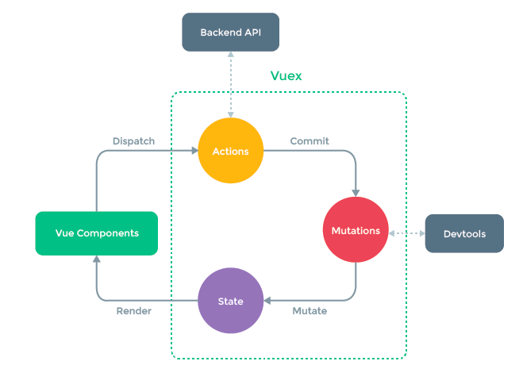

# 08-01 城市选择页面路由配置

1. 现在希望首页点击城市进入到城市的页面，那么如何做到这点？`<router-link>`
2. 加上变量的话那么就可以一改全改了

# 8-2 Vue项目城市选择页 - 搜索框布局
# 8-3 Vue项目城市选择页 - 列表布局

>上面两个没有


# 8-4 Vue项目城市选择页 - BetterScroll 的使用和字母表布局

1. 给.list上增加了一个overflow:hidden以及绝对定位，这就导致了页面是拖不动的。这就出来了另外一个包，`better-scroll`,可以在github上搜索一下.

```
yarn add better-scroll --save
```

需要这两步,

```
let wrapper = document.querySelector('.wrapper')
let scroll = new BScroll(wrapper)
```

符合dom结构才行。`ref`可以帮组我们获取dom,

2. 新建Alphabet.vue创建右边的字母表


# 08-05 页面的动态数据渲染

让数据动态展示，通过ajax获取内容。


# 08-06 兄弟组件间的联动

1. 点击右边的字母，能滚到相应的页面。
2. 获取点击的内容，传到list组件，跳到相应的区
3. 兄弟传值->父亲->另一个兄弟 。父组件通过props传递给子组件
4. letter传过去给list.vue后，显示对应的，要监听器，watch.
5. better-scroll提供了一个接口，滚动到某一个元素上。加上一个`ref`,获取到的是一个数组，不是dom元素。

下一步做内容拖动的时候，监听到右边的变化

1. alphabet.vue绑定touchstart 、touchmove、touchend、事件
2. 我们希望现在是touchStart以后才可以touchmove里面的内容，在data里面定义的标示位。`touchStatus`默认为false,当手指触摸的时候
3. 获得A到顶部的高度，当前手指位于顶部的高度。你想根据下表找到下标对应的字母的话
4. touchmove的时候会获取到touchY 

# 08-07 列表切换性能优化

1. 每次执行 handleTouchMove的时候都会运行一次，startY,这样他的性能会比较低。那么怎么优化的呢？

2. `updated`,ajax发送数据的以后，alphabet这个组件重新渲染，那么这个update钩子就会被执行,
3. 鼠标在字母表上移动的时候，他的来回的频率是比较高的。这个时候函数节流限制执行的频率,定义一个timer。

# 08-08 搜索功能实现

1. 实现search这个组件
2. search组件需要接收传递过来的cities
3. 再写一个watch,节流。监听keyword的改变
4. 符合的关键词列表循环
5. 发现搜索出来的东西特别多的时候没发滚动了，那么怎么来处理？better-scroll来，且借助两个生命周期钩子
6. 如果this.keyword不存在list为空数组且return掉。没有匹配项的时候，也显示一个结果

# 08-09  使用vuex实现数据共享

1. 现在希望 当我在city页面选择了一个城市之后，首页的城市也能跟着变，这就说明城市选择页面的数据要传递给首页，那么怎么传？vuex登场
2. city.vue和home.vue没有公共的页面传，

### 1. vuex讲解

1. vuex就是数据的单向改变的流程，数据层框架
2. 首先安装vuex.




### 2. vuex细讲

1. 如果有异步操作或者是复杂的同步操作，我们是可以把他放到actions这里的。Mutations里面放的是一个一个同步的的对state的修改，
2. 有的时候我们也可以跳过actions，让组件直接跳过mutations修改state里面的数据。


### 3.vuex在项目中讲解

1. src下新建一个store的文件夹，然后建一个文件`index.js`点击热门城市会改变state里面的数据
2. actions对象，changeCity是一个方法会接受两个参数，点击热门城市的时候，actions就会被派发，写在store/index.js,mutations对应的参数也会有两个。
>`ctx`，`commit`不知道是什么意思。
3. search组件的也要改变。搜索后点击城市发生改变
4. 点击桂林的时候，不仅改变当前城市还能返回到首页。[编程式导航](https://router.vuejs.org/zh/guide/essentials/navigation.html)

在改变路由的时候不仅能从a标签，还能通过js来改变路由。vue-router里面用了一个push的方法。`this.$router.push('/')`,希望改变城市后跳转到首页

### 4. 注意的点

在city页的当前城市那里，既没有异步调用也没有集成的同步调用，因此可以通过绕过actions来改变state。08-09

#  8-10  Vue项目城市选择页 - Vuex的高级使用及localStorage

## 1. 城市应该变成你上次选择的城市

1. 当用户尝试改变城市的时候，设置state的默认值是从state里面取，建议使用localstage的时候使用try,catch,因为用户关闭了本地存储，或者使用了隐身模式，那么就会抛出异常。改变了store/index.js 08-10-01
 
``` 原来不加try-catch的写法
export default new Vuex.Store({
    state:{
        city:localStorage.city || '上海'
    },
    mutations:{
        changeCity(state,city){
            state.city=city
            localStorage.city=city
        }
    }
})
```

``` 加上try-catch的写法
let defaultCity = '上海'
try {
    if (localStorage.city) {
        defaultCity = localStorage.city
    }
} catch (e) {}

export default new Vuex.Store({
    state:{
        city:defaultCity
    },
    mutations:{
        changeCity(state,city){
            state.city=city
            try{
                localStorage.city=city
            }catch(e){}
            
        }
    }
})

```

2. 现在发现store/index.js里面的代码变得复杂起来了，现在创建一个state.js,创建mutations.js

3. 对pages下面的homeHeader组件进行代码优化。

`import {mapState} from 'vuex'` 有一个映射。

```
computed:{
    ...mapState({
        currentCity:'city'
    })
}
```
我想把vuex里面公用的数据city映射到我这个组件的计算属性里，映射过来的名字叫做currentCity.

4. `import {mapMutations} from 'vuex'`,

在methods里面应用mapmutations,`...mapMutations(['changeCity'])`,我们有一个mutation叫做city,然后我把这个mutation映射到我这个组件里面，名字叫做`changecity`的方法里，那么我要调这个mutations就没有那么不必要的写了，

```
//city list.vue
handleCityClick(city){
      this.$store.commit('changeCity',city)
       this.$router.push('/')
    }
```

改成：

```
handleCityClick(city){
      this.changeCity(city)
      this.$router.push('/')
    }

    ...mapMutations(['changeCity'])
```
## 2. vuex几个重要的点

1. state
2. mutations
3. getter： 类似与组件中的computed计算属性的作用，当我们需要根据state里面的数据算出一些新的数据的时候，我们就可以借助getter来提供新的数据，这样可以避免数据的冗余。
4. module-当遇到非常复杂的业务场景，比如在做后台管理系统的时候，经常会有很多公用的数据在vuex里面进行存储，如果我们把所有的mutation都放到mutations文件里，这个文件慢慢会变得非常庞大难以维护，我们这个时候可以借助module,对一个复杂的state包括actions进行拆分，创建store的时候可以通过模块对store进行创建。

## 3. mapGetters用例的讲解

在header.vue中

```home header.vue
import {mapState , mapGetters} from 'vuex'
export default {
  name: 'HomeHeader',
  computed:{
    ...mapState(['city']),
    ...mapGetters('doubleCity')
  }
}

```

```store/state.js
export default new Vuex.Store({
    state,
    mutations,
    getters:{
        doubleCity (state){
            return state.city + '' + state.city
        }
    }
})
```

# 8-11 Vue项目城市选择页 - 使用keep-alive优化网页性能

发现这里的性能优化是直接套上了`keep-alive`这个组件,这里有讲解[keep-alive](https://cn.vuejs.org/v2/guide/components-dynamic-async.html#%E5%9C%A8%E5%8A%A8%E6%80%81%E7%BB%84%E4%BB%B6%E4%B8%8A%E4%BD%BF%E7%94%A8-keep-alive)

>这一节的课程打不开啊

